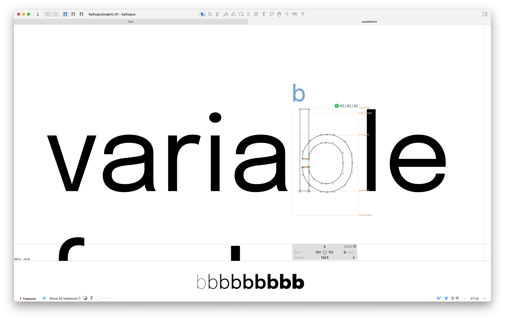
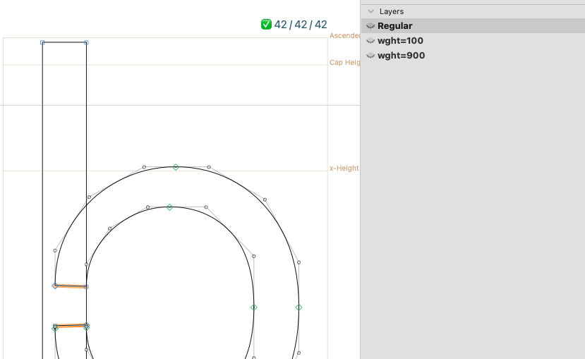
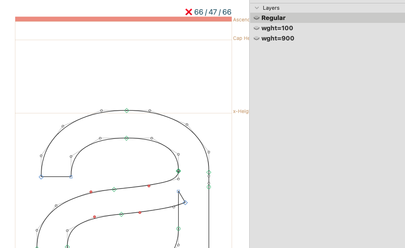

# Node Counter Between Layers

A [Glyphs.app](https://glyphsapp.com/) plugin to display the number of nodes between multiple masters for checking compatibility easily.

用來顯示多個主板之間的路徑總節點數，用來對主板之間的相容性。

|Check ✅|Waring ❌|
|:---:|:---:|
|||

- *Demo font: [Epilogue Variable Font](https://github.com/Etcetera-Type-Co/Epilogue)*

## Installation

1. One-click install the plugin.
2. Restart Glyphs (cmd+Q).
3. Toggle *View > Show Node Counter Between Masters*.

## Requirements

The plugin works in Glyphs 3.1 (3133) in macOS Monterey (12.6) with Python 3.9.1. I've only tested it in the current environment, and perhaps it works on earlier or later versions too.

## License

Copyright 2023 ChingRu (@rutopio).

Based on sample code by Georg Seifert (@schriftgestalt) and Jan Gerner (@yanone).

Licensed under the Apache License, Version 2.0 (the "License"); you may not use this file except in compliance with the License. You may obtain a copy of the License at http://www.apache.org/licenses/LICENSE-2.0

See the License file included in this repository for further details.
